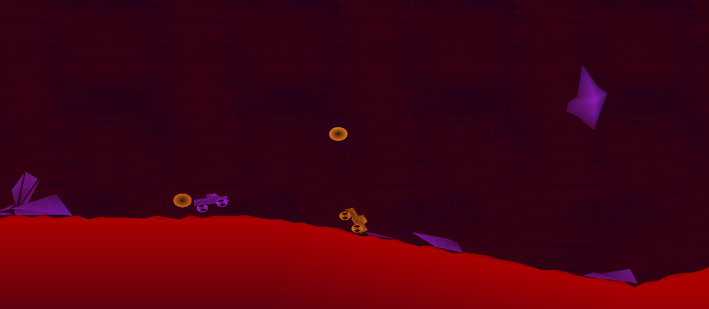
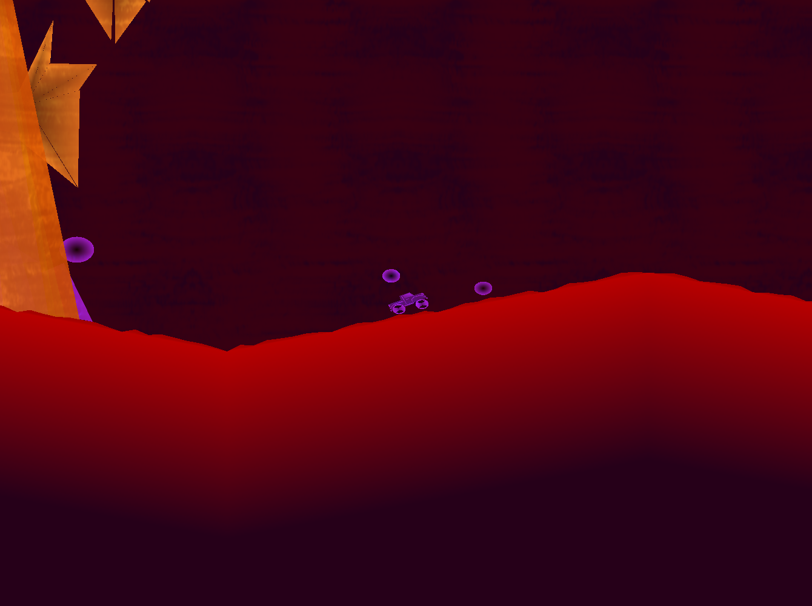
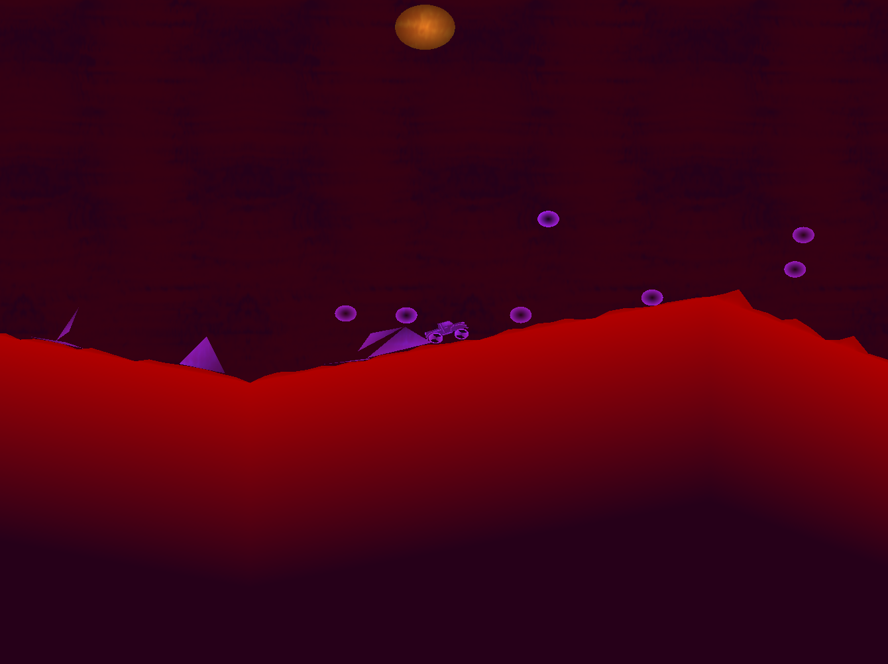

#  Mars Volcano Dash

An endless runner game that uses the Box2D physics engine, GLFW and stb_image.

---

## TODO

- namespaces
- doxygen
- pragma once...
- yeet old linked list
- keyboard class (Utility)
- refactor
- - manager
- - gamemanger
- - player
- - 

---

## Gameplay

You work for a mining company that operates on the surface of Mars.
For your work you drive an armoured pickup truck that you use to transport mined materials.
A volcano has just erupted near your current position, sending massive boulders and meteors into the sky as well as molten lava across the Martian surface.
Your vehicle is armoured and can withstand the force from incoming debris, however you cannot survive being completely submerged in lava.
The lava from the eruption is progressively moving towards you while incoming debris from the eruption is falling down and littering your path!
You must navigate the volatile terrain in an attempt to save your life...

### Menu Controls

Use W & S to scroll up and down, and Enter to select an option

### Gameplay Controls

Escape ⇒ Pauses the game

\+ / \- ⇒ Zoom camera in / out

W ⇒ Forwards (right along the track)

S ⇒ Backwards (left along the track)

A ⇒ Apply force to tilt car CCW

D ⇒ Apply force to tilt car CW

Player 2 controls are the same but with the following mappings (basically moving WASD along your keyboard to IJKL)

I ⇒ W,
K ⇒ S,
J ⇒ A,
L ⇒ D

---

## To come

- A few small graphics updates
- Gameplay guide
- Modification Guides (easy ways to modifiy the gamemodes, enemies, etc)

---

## Repository break down

- **GameControl,** files associated with controlling the game either on menu or while running
- **GameEntities,** files associated with creating, controlling and destroying game entities e.g., player's car, boulders, etc
- **include,** all the external .h files required to compile the program (Box2D, GLFW, stb_image)
- **libraries,** the .a and .dll files associated with the external libraries (Box2d, GLFW)
- **RepoResources,** FAQs, Guides, and Images to make the repository look nice
- **Utility,** basic utility functions/classes that are used throughout the code
- **Visuals,** files associated with drawing graphics to the screen

---

## Important (Licenses)

See LICENSE.md for the official license, but here's the tldr

I'm releasing my own work under the MIT license and you're free to do with it as you wish so long as you follow the license's copyright notice and permissions properly.
As far as I can tell that means stick said license in any released work you've built off my work in relation to my work, but other than that you should be free to do whatever you want :)

https://www.tawesoft.co.uk/kb/article/mit-license-faq

My background is computer science and programming not law, but that's the gist I've gathered about how the license works.
Although I'm not really expecting too many people are going to be making and releasing games based directly off my code anyhow lol

**Everything inside of the "include" and "libraries" are not my work.
And as such are under their corresponding licenses, see below.**

### Box2D

Box2D is released under its own MIT license, you can check out the GitHub repo here: https://github.com/erincatto/box2d

And the website here: https://box2d.org/

Obviously the actual Box2D engine was developed by Erin Catto and the code belongs to him.
Make sure if you are using any of the Box2D files here in your own project you correctly credit and attach the correct MIT license with it.

All the functionality from the DLL comes from Box2D so I'm not claiming any ownership over the lib and DLL files,
hence I've attached the original Box2D MIT licence to them.
All I've done to the original Box2D code is recompile it into a single DLL hence removing the dependency on cmake.
I did this using a separate CodeBlocks project that contained all the .cpp and .h files.

### GLFW

GLFW is licensed under the zlib/libpng license, see here: https://www.glfw.org/license

I've used version 3.3.7 as that was the latest release at time of download.
I downloaded the 64-bit Windows binaries from the GLFW website, https://www.glfw.org/

Regarding the downloaded binaries,
I've used the "glfw3.dll" and the "libglfw3dll.a" files found inside of the "lib-mingw-64" folder.
As well as the header files found inside the "include/GLFW" directory.
Obviously these files are not my work and are under the aforementioned zlib/libpng license,
with copy right going to Marcus Geelnard and Camilla Löwy.

### stb_image

stb_image can be licensed under two different licenses depending on choice, I've opted to use the Public Domain license.

You can check out the GitHub repo here: https://github.com/nothings/stb

I needed a quick and easy way to load png images hence I've only used the image loader library "stb_image.h".
Hence I copied the header file off the GitHub repository.
Obviously this file is Sean T Barrett's work and is under the aforementioned Public Domain License.

**The above Box2D, GLFW and stb_image licenses are placed inside of this projects LICENSE.md file with indication to where they apply,
they can also be found in the directories where their corresponding files exist as well as in any code taken directly from the libraries (i.e., their header files).**

---

## Final notes

I'm releasing and licensing what I've done under MIT, feel free to do what you like with it (as long as you follow the license's terms).
**Just be careful when using parts of the program which I haven't built, (Box2D, GLFW, stb_image) and make sure to reference their licensing properly.**
Other than that I encourage you to play around and modify the likes of the game mode configuration, the players car, or even add in new enemies.
Do so to your hearts content!
I've left the CodeBlocks project in the repo that way you should be able to toy around with the code without any knowledge of setting up the compiler/linker.

**Just note any modifications that you make, you are making of your own accord and at your own risk, and I will not be held responsible (Basically the bold section of the MIT license that I'm licensing my work under, see below)**

THE SOFTWARE IS PROVIDED "AS IS", WITHOUT WARRANTY OF ANY KIND, EXPRESS OR
IMPLIED, INCLUDING BUT NOT LIMITED TO THE WARRANTIES OF MERCHANTABILITY,
FITNESS FOR A PARTICULAR PURPOSE AND NONINFRINGEMENT. IN NO EVENT SHALL THE
AUTHORS OR COPYRIGHT HOLDERS BE LIABLE FOR ANY CLAIM, DAMAGES OR OTHER
LIABILITY, WHETHER IN AN ACTION OF CONTRACT, TORT OR OTHERWISE, ARISING FROM,
OUT OF OR IN CONNECTION WITH THE SOFTWARE OR THE USE OR OTHER DEALINGS IN THE
SOFTWARE.

On a final note I'd like to thank my friend Mike for the idea of a chasing game when I asked for possible ideas for physics engine based games!

